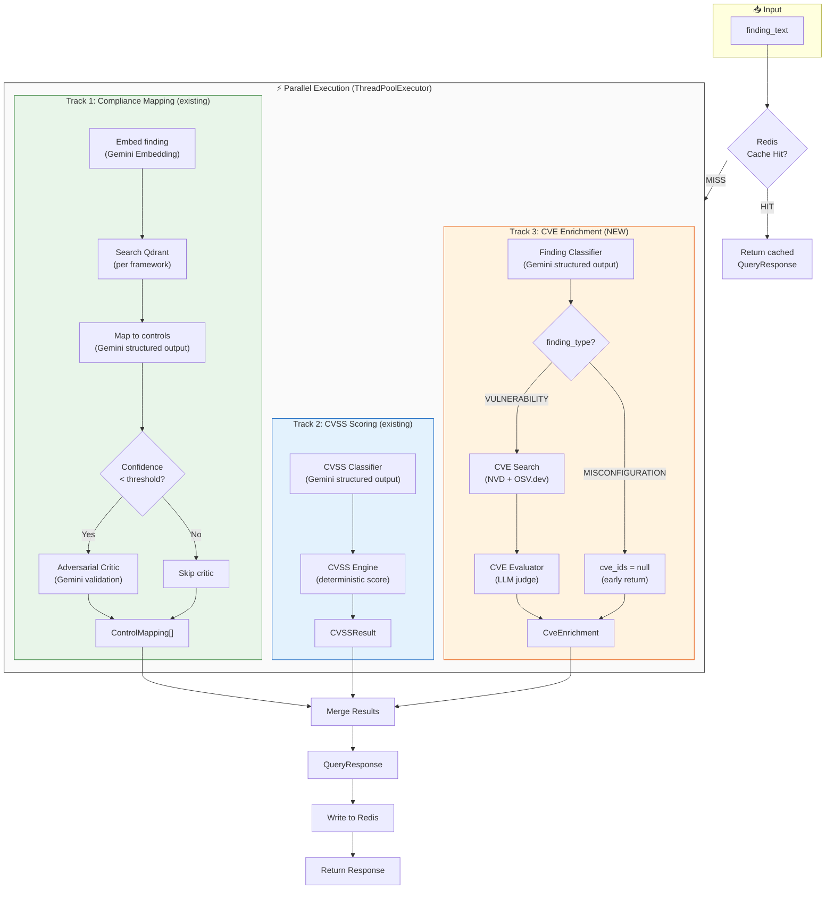
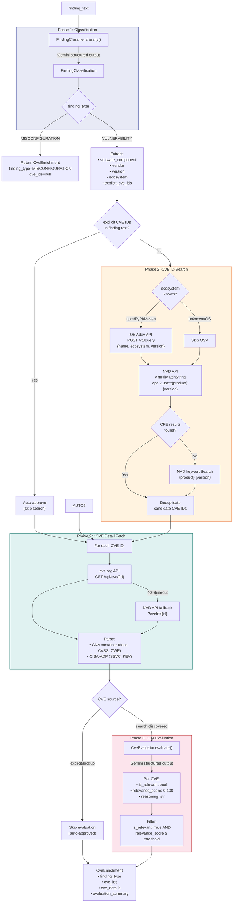
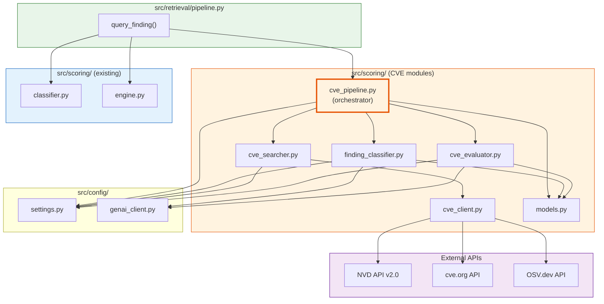
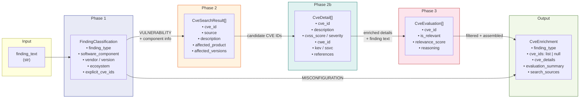
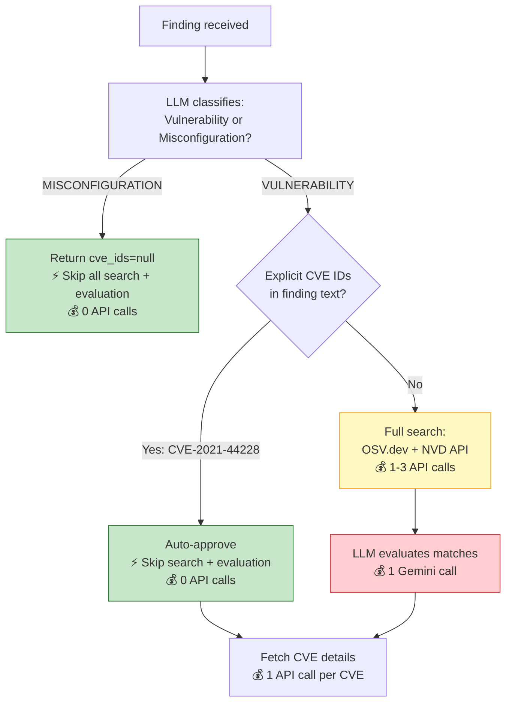

# CVE ID Management — Workflow Diagrams

## 1. End-to-End Pipeline Flow

The complete flow from finding input to enriched response with CVE data.

---

## 2. CVE Enrichment Track — Detailed Flow

The internal flow of Track 3 (CVE enrichment) in detail.

---

## 3. Module Dependency Graph

Shows which modules depend on which, following Dependency Inversion.

---

## 4. Data Flow — Model Transformations

Shows how data models transform through each stage.

---

## 5. Short-Circuit Decision Tree

Shows when the system skips expensive operations.

